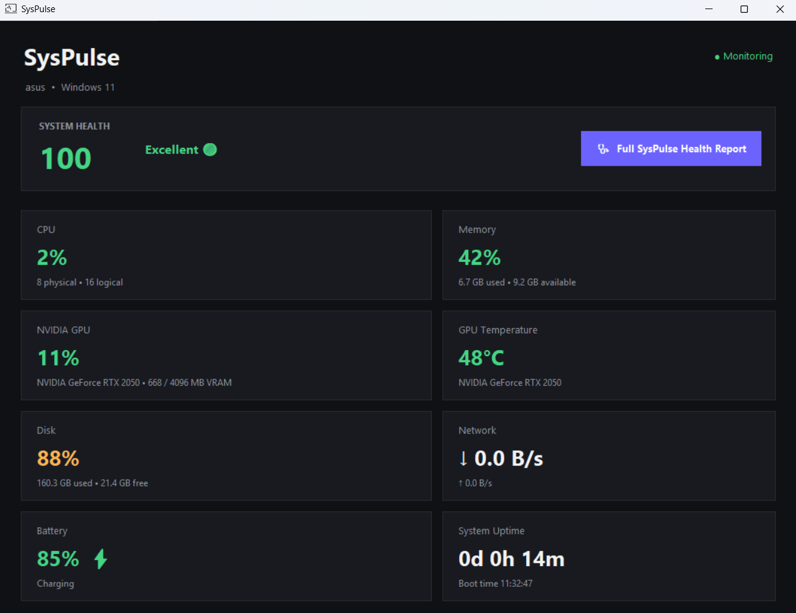
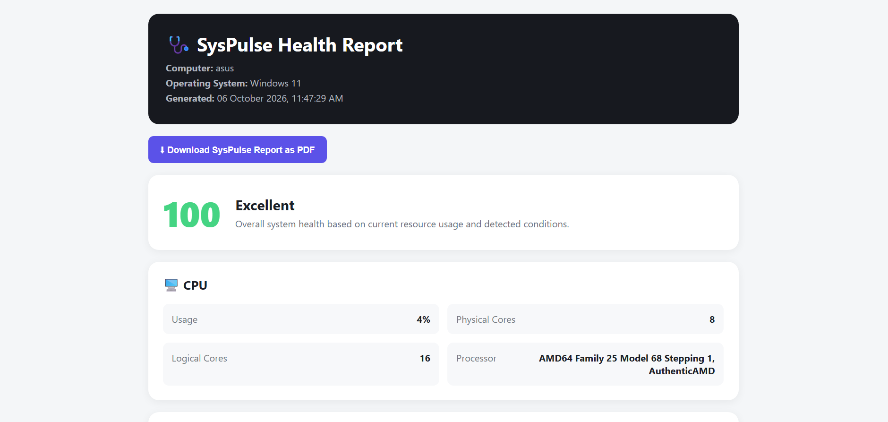

# SysPulse 🩺

A lightweight Windows system monitoring dashboard built with Python and Tkinter.

SysPulse provides a live overview of system health, resource usage, GPU information, battery status, network activity, storage, uptime, top processes, and a generated HTML health report.

## ✨ Features

- 🖥️ Live CPU usage and processor information
- 🧠 RAM usage, used memory, total memory, and available memory
- 🎮 NVIDIA GPU usage, temperature, and VRAM information
- 💾 C: drive storage usage
- 🌐 Download and upload network activity
- 🔋 Battery level and charging status
- ⏱️ System uptime and boot time
- ⚠️ Automatic system health score and alerts
- 🔥 Top CPU-consuming processes
- 🩺 Full HTML health report with recommendations
- 📄 Browser-based report printing / PDF export
- 🌑 Dark desktop dashboard
- 🪟 Standalone Windows executable

## 📸 Screenshots

### Main Dashboard

### Health Report

## 🚀 Run the Executable

For Windows users who just want to use SysPulse:

1. Download **SysPulse.exe** from this repository.
2. Run it.
3. SysPulse will start monitoring the computer locally.

No Python installation is required when using the executable.

## 🐍 Run from Source

### Requirements

- Windows
- Python 3.10+
- `psutil`
- NVIDIA drivers + `nvidia-smi` for NVIDIA GPU telemetry

Tkinter is included with standard Windows Python installations.

### Installation

Clone the repository:

~~~powershell
git clone https://github.com/Athuldas2006/SysPulse.git
cd SysPulse
~~~

Install the dependency:

~~~powershell
python -m pip install -r requirements.txt
~~~

Run SysPulse:

~~~powershell
python src/SysPulse.py
~~~

## 📁 Project Structure

~~~text
SysPulse/
├── assets/
│   ├── icon.ico
│   ├── SysPulse.png
│   └── SysPulse1.png
├── src/
│   └── SysPulse.py
├── SysPulse.exe
├── .gitignore
├── LICENSE
├── README.md
└── requirements.txt
~~~

## 🛠️ Built With

- Python
- Tkinter / ttk
- psutil
- NVIDIA SMI
- HTML / CSS for generated reports

## 🔒 Privacy

SysPulse is designed as a local desktop monitoring application. System information is collected locally for display and report generation; the application does not require an online account or cloud backend.

## 📌 Notes

GPU telemetry depends on `nvidia-smi`. If NVIDIA GPU information is unavailable, the rest of the monitoring dashboard can still operate.

The generated health report is saved locally in a `Reports` folder next to the executable or source script.

## 📄 License

This project is released under the MIT License. See [LICENSE](LICENSE) for details.
